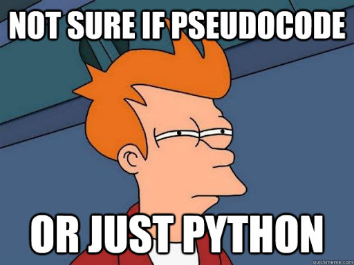

# Overview

---

  

## Who is this for?

- Anyone (technical) working with Python and data!

## What will be covered?

- Asynchronous Programming and Key Concepts

- Asynchronous Programming in Python

- The SQLAlchemy ORM

- Asynchronous SQLAlchemy

## Why should I care about this?

- Asynchronous programming is becomming more and more popular in the Python programming language, given the need for increased performance and to compete with other languages/runtimes that embrace the concept natively (Go, Node.js, C#, etc)

- Whether you're a developer, data scientist, business analyst, etc, accessing data is a crucial part of creating impactful programs. If you use Python (and need to access data), you'll likely end up using SQLAlchemy given it's the most popular ORM (object-relational model) in the ecosystem. Did I mention the next major release of it is going async?

# Introduction to Asynchronous Programming

---

> **Asynchrony**, in computer programming, refers to the occurrence of events independent of the main program flow and ways to deal with such events
> These may be "outside" events such as the arrival of signals, or actions instigated by a program that take place concurrently with program execution, without the program blocking to wait for results. **-Wikipedia**

  

Well that definition is certainly a mouthful...

I find the following definition a little more pragmatic

> Asynchronous programming is a form of parallel programming that allows a unit of work to run separately from the primary application thread

A little better, but what is "parallel programming"? Let's explore some key definitions we'll need to talk meaningfully about asynchronous programming

## Key Concepts

### Threads

Depending on whether you're talking about hardware or software, there are a couple different types of "threads". At a high level, we can generalize a thread as something on your computer that can do a unit of computational work

- **Hardware Thread** - In theory, this is based off of the number of CPUs on your computer (IE, 4 CPUs = 4 hardware threads, or the ability for your computer to do 4 things at once). However, modern CPUs use something called "hyperthreading" so in practice the number of hardware threads is higher than the number of CPUs (this is outside the scope of this talk)

- **Software/OS Thread** - Your operating system (OS) has it's own abstraction of a "thread". Your OS dispatches "work" to these threads, which in turn are run on hardware threads (the hardware thread can be thought of like the "engine" that the software thread runs on)

Overall, the above is a massive oversimplifcation of what's going on, and I'm sure some hardware guru out there will skewer me for my inaccuracies. Oh well

### Parallelism

This is the idea of performing multiple operations at the same time. Your computer has multiple CPUs and hardware threads, therefore theoretically it can (and does) do multiple things at the same time

The more precise term for spreading work over a computers CPUs is **Multiprocessing**. This type of parallelism is very good in the case where you have a **CPU bound** task, or a task where the time to complete it is mainly derived from the speed at which CPU(s) can process it

Many machine learning algorithms and other mathematically intensive computations fall in to this category

### Concurrency

Concurrency is very similar to parallelism, but with one important distinction. It suggests that tasks _can_ run at the same time (but don't necessarily have to)

Parallelism is concurrency, but not vice versa.

Many modern programming languages embrace concurrency, and it is particularly useful for addressing the inefficiences of **I/O bound** tasks. An I/O (input/output) bound task is one in which the time to complete it is mainly derived from the time spent waiting for some I/O operation to complete. Examples of these are reading from the local file system, making an HTTP request, or waiting on data from a database

Below is a visualization that always helps me differentiate parallelism and concurrency

  

# Asynchronous Programming in Python

---

NOTE: We won't cover legacy asynchronous programming in Python, in the interest of time

- Async/await syntax (native coroutines)

- Coroutine function vs coroutine object

- Will skip generator based coroutines

- Coroutine is a generator, but a generator is not a coroutine
